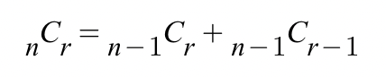

```
class Solution {
    public int solution(int balls, int share) {
        // n! / (n-m)! * m!   n개중 m개 뽑기
        return combination(balls, share);
    }
    public static int combination(int balls, int share){
        if(balls == share || share == 0){
            return 1;
        }else{
            return combination((balls-1), share-1) + combination(balls-1, share);
        }
        
    }
}
```



